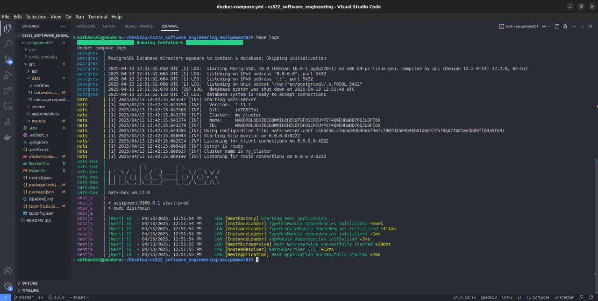
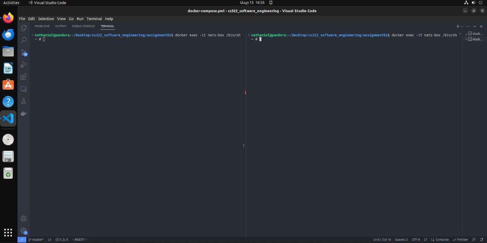
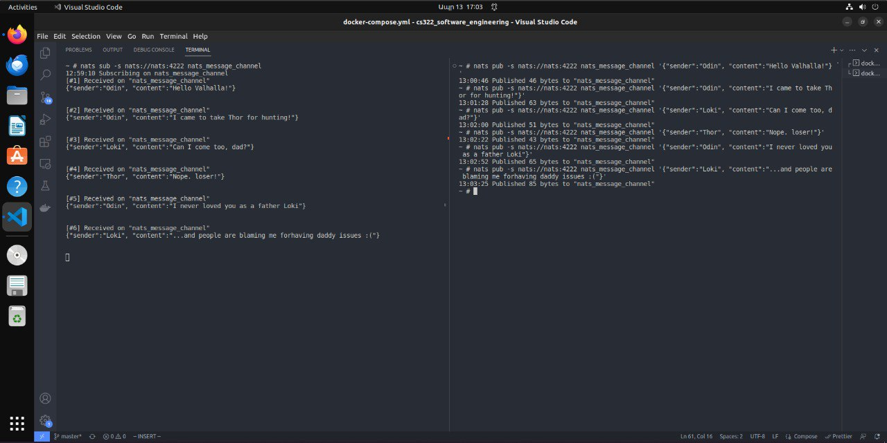
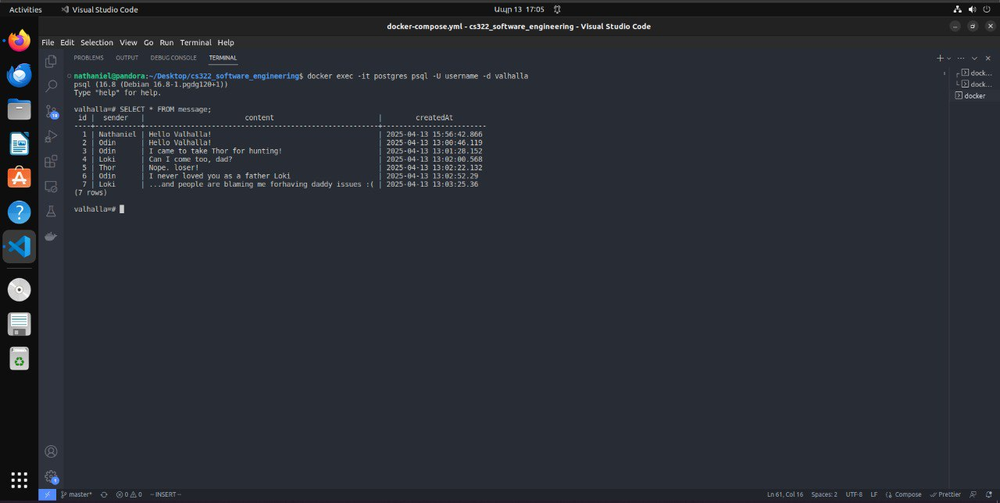

## 📦 NATS Subscriber (NestJS)

## 📖 Project Description

This project demonstrates a **message-driven backend service** using:

- **NATS** as the message broker.
- **NestJS** for the service application framework.
- **PostgreSQL** for message persistence.
- **TypeORM** for object-relational mapping (ORM).

The service listens to a specific NATS channel, processes received messages, and saves them to the database.

---

## 🏗️ 3-Layer Architecture

| Layer                      | Description                                                                          |
| :------------------------- | :----------------------------------------------------------------------------------- |
| **Presentation/API Layer** | Exposes message subscription endpoints via NATS message patterns.                    |
| **Application Layer**      | Business logic for processing incoming messages and interacting with the data layer. |
| **Data Layer**             | Handles database operations via a repository pattern using TypeORM.                  |

This clean separation ensures the system is modular, testable, and scalable.

---

## ⚙️ Setup Instructions

### 1️⃣ Clone the Repository

```bash
git https://github.com/Sargis-Hovsepyan/cs322_software_engineering.git
cd assignment01
```

Now here in order to make your life easier the task is compiled using docker-compose file which is situated in the root of the project.
and in order to make the compilation proccess smooth there is a make file that does everything. Please examine it to understand what you are running.

#### 2️⃣ Run the Docker Services

Run the following command to build and run the containers

```bash
make build
make up
```

Once it is started you can see the logs by running:
```bash
make logs
```

after running you should see something like this 


#### 3️⃣ NATS Subscriber/Publisher

In order to take messages from the NATS Queue we need to have a subscriber and for having messages there we need a publisher. 
In the first terminal hop into `nats-box` for subscribing and in another hop into another tty to publish messages: 

```bash
docker exec -it nats-boxs /bin/sh
```




After that, run the follwing commands inside the nats-box to subscribe to the message queue:
```bash
nats sub -s nats://nats:4222 nats_message_channel                           # Subscribe to chanel in one terminal

nats pub -s nats://nats:4222 nats_message_channel <YOUR_MESSAGE_AS_JSON>    # Publish messages in another terminal
```


#### 4️⃣ Check the PostgreSQL for saved messages

First hop into the postgres container from another terminal

```bash
docker exec postgres psql -U username -d valhalla
```

the username and database name are specified in `.env` file.\
Once you are in the Postgres run the following command:
```bash
SELECT * FROM messgae;
```

And you will see the table of messages




## Conclusion

Here we see that the app receives nd saves the messages published in the NATS queue. After all this let's do clean up.

To stop containers and networks:
```bash
make down
```

To remove containers and node+modules:
```bash
make prune
```


